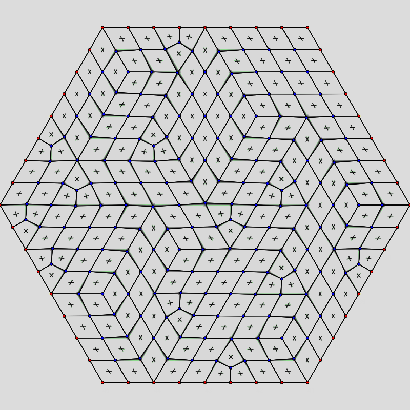
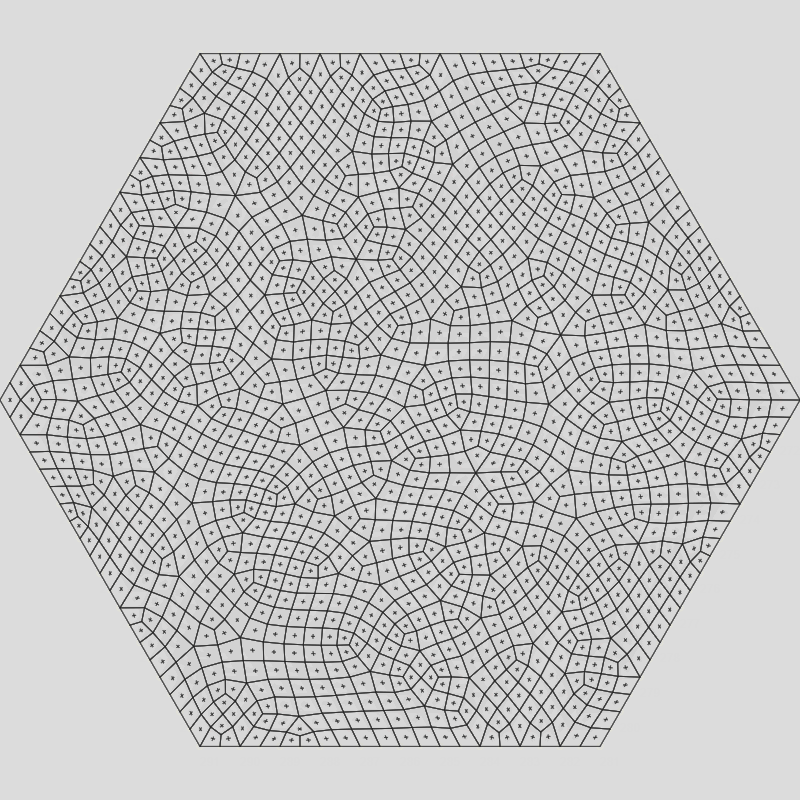

# Townscaper -ish Topography / Quadangulation

This project aims to test the quadangulation algorithm for some stylized modeling, simulation of urbanism, which I learned from the grid that is used by Oskar Stålberg in his game, Townscaper.

Due to the difference in algorithmic specificty, there is some difference in the effects of it from Oskar's original.

<!-- .png) -->
